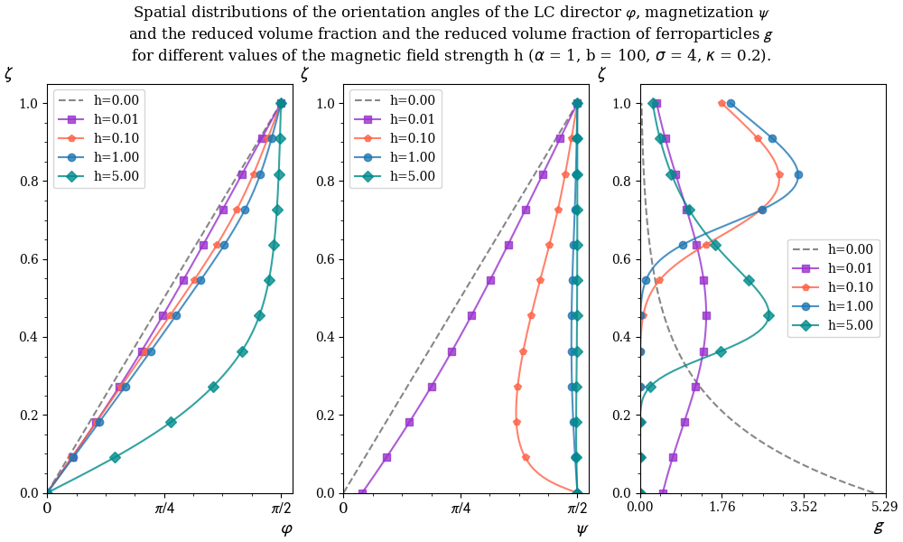

# Twist Ferronematic

This program is designed to simulate the stratification of ferroparticles caused by gravitational and magnetic fields in soft ferronematics.

More detail about this problem and the meaning of ferronematic, you can found in this [*article*][1].

## Using
The code is written using **standard ISO C++17 (/std::c++17)**.

The program requires third-party libraries [*JSON for Modern C++*][2] and [*Eigen*][3].

**The program executable file** must be passed a json file of the following form:
```
{
    "twist_ferronematics": [
        {
            "h": [0.10],
            "configuration": {"alpha": 1.00, "b": 100.00, "sigma": 4.00, "kappa": 20.00, "nodes": 100}
        }
    ]
}
```
- The parameter *h* characterizes the magnetic field in which the twist-ferronematic (TF) is located;
- The *alpha*, *b*, *sigma*, *kappa* parameters are responsible for the properties of an individual twist ferronematic (in detail about each parameter in the [*article*][1]);<br/>
- *nodes* - the number of points of the computational grid required for the numerical solution of the equations of equilibrium state. 

### Example

As an example, take the input data file *inputs.json*:
```
{
    "twist_ferronematics": [
        {
            "h": [0.00, 0.01, 0.10, 1.00, 5.00, 50.00],
            "configuration": {"alpha": 1.00, "b": 100.00, "sigma": 4.00, "kappa": 20.00, "nodes": 100}
        },

        {
            "h": [0.00, 0.01, 0.10, 1.00, 5.00, 50.00],
            "configuration": {"alpha": 1.00, "b": 100.00, "sigma": 4.00, "kappa": 0.20, "nodes": 100}
        }
    ]
}
```
In this case, the simulation will be performed for two twist-ferronematics. For each TF, a set of magnetic field values (*h*) is determined at which the simulation will be performed.

```
<The program executable file> inputs.json
```

The result of the simulation will be in the automatically created folder *"results"* in the current directory. For the above input values, the output will be twelve csv files. The name of each file contains the values of the parameters at which the simulation was performed.
```
'h = 0.00, alpha = 1.00, b = 100.00, sigma = 4.00, kappa = 20.00, notes = 100.csv'
'h = 0.01, alpha = 1.00, b = 100.00, sigma = 4.00, kappa = 20.00, notes = 100.csv'
'h = 0.10, alpha = 1.00, b = 100.00, sigma = 4.00, kappa = 20.00, notes = 100.csv'
'h = 1.00, alpha = 1.00, b = 100.00, sigma = 4.00, kappa = 20.00, notes = 100.csv'
'h = 5.00, alpha = 1.00, b = 100.00, sigma = 4.00, kappa = 20.00, notes = 100.csv'
'h = 50.00, alpha = 1.00, b = 100.00, sigma = 4.00, kappa = 20.00, notes = 100.csv'

'h = 0.00, alpha = 1.00, b = 100.00, sigma = 4.00, kappa = 0.20, notes = 100.csv'
'h = 0.01, alpha = 1.00, b = 100.00, sigma = 4.00, kappa = 0.20, notes = 100.csv'
'h = 0.10, alpha = 1.00, b = 100.00, sigma = 4.00, kappa = 0.20, notes = 100.csv'
'h = 1.00, alpha = 1.00, b = 100.00, sigma = 4.00, kappa = 0.20, notes = 100.csv'
'h = 5.00, alpha = 1.00, b = 100.00, sigma = 4.00, kappa = 0.20, notes = 100.csv'
'h = 50.00, alpha = 1.00, b = 100.00, sigma = 4.00, kappa = 0.20, notes = 100.csv'
```
The visualization of the obtained data is as follows.<br/>


<br/>




The [*article*][1] provides an explanation of the meaning and origin of the quantities 𝜁, 𝜑, 𝜓, *g* and the analysis of the resulting graphs.


[1]:https://iopscience.iop.org/article/10.1088/1742-6596/1389/1/012058
[2]:https://github.com/nlohmann/json/releases/tag/v3.9.1
[3]: https://eigen.tuxfamily.org/index.php?title=Main_Page